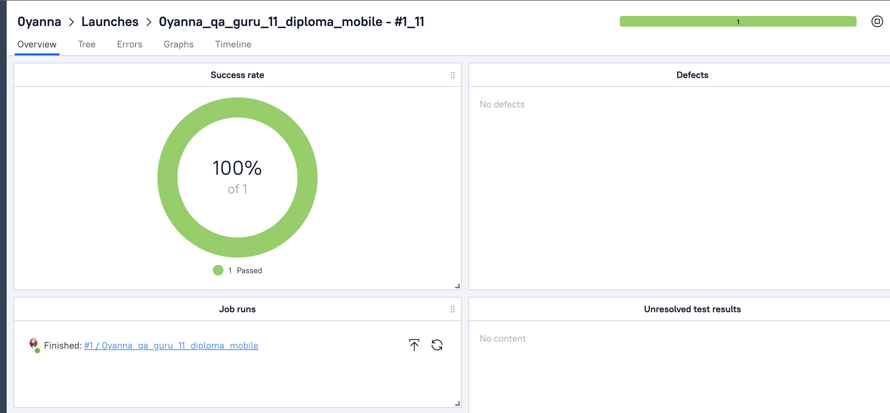
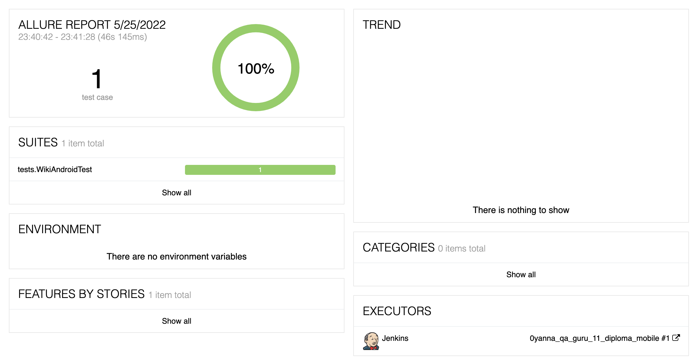
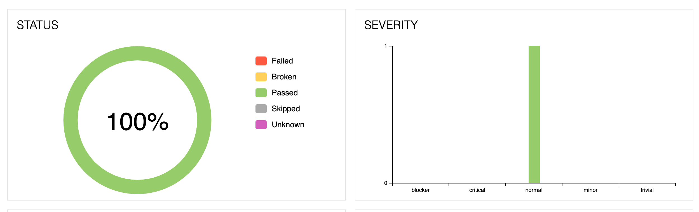

# Проект мобильного автотестирования www.wikipedia.org/

### :bar_chart:	Тест на поиск в Wiki

### :woman_technologist: Technology stack:

### Allure TestOps

### <a target="_blank" href="https://jenkins.autotests.cloud/job/0yanna_qa_guru_11_diploma_mobile/1/allure/">Allure report</a>

:chart_with_downwards_trend: Graphs

### Видео выполнения теста

  

